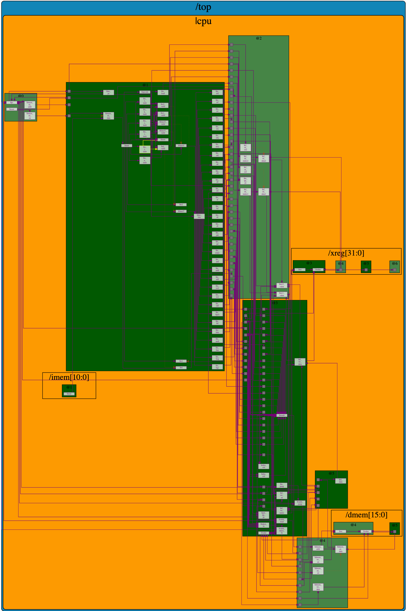
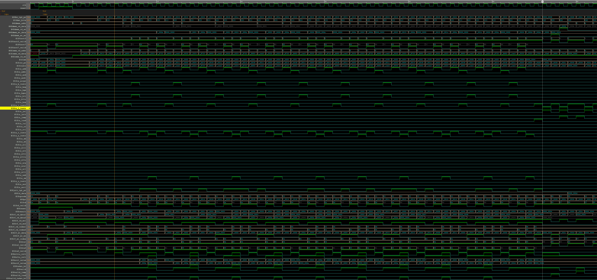

# RISC-V-Myth
Coursework by https://www.vlsisystemdesign.com/

### Environment and Tooling

#### Risc-v compiler
On a MacOS with a apple M2 cpu I have used https://github.com/riscv-software-src/homebrew-riscv to set up the RISC-V toolchain which includes Spike

#### OSS CAD Suite MacOS M1/2: https://github.com/YosysHQ/oss-cad-suite-build
Required for the picorv32 cpu and firmware lab at https://github.com/kunalg123/riscv_workshop_collaterals/tree/master/labs

Download the latest release from https://github.com/YosysHQ/oss-cad-suite-build/releases/latest

It has many tools including yosys, ABC, nextpnr, icestorm, iverilog, verilator, gtkwave

#### Makerchip for the MYTH Workshop
Goto https://makerchip.com/ to complete the Steve Hoover RISC-V_MYTH_Workshop

### Completed MYTH RISC-V CPU

-- MYTH RISC-V CPU Diagram

-- MYTH RISC-V CPU Waveform

-- [Final pipelined MYTH RISC-V code](https://github.com/davidbroughsmyth/RISC-V-Myth/blob/main/lab7_pipelined-and-finished_riscv/Complete_MYTH_RISC-V_CPU.v)
